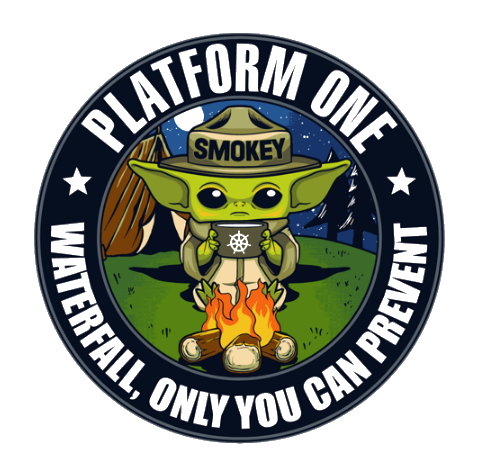

Teaser: You can check out the [guide](https://alexjbuck.github.io/digitize-guide/) I wrote!

This was a long journey, so buckle up.

- - -

Jump back to March, 2020. The COVID-19 pandemic has just kicked off and everyone stops going into the office. I was lucky to work at the MH-60R Weapons School where we all had our own work laptop to use that we could take home with us to conduct unclassified business on. The Navy promises "CVR Teams" which was a Navy branding of the Microsoft 365 product. It works *alright* but it introduced an entire generation of sailors to collaborative tools in a work environment. The main issue was that it was slow to roll out so there was a gap in coverage.

While CVR was rolling out I started looking around for other alternatives that were still approved for DoD use. At the time I didn't even know what that meant other than knowing that "slack is not approved". 

After a long time of searching down the Google machine I found Baby Yoda.

I can tell you I didn't know what waterfall is, but I thought it was pretty cool that a DoD project had Baby Yoda as their mascot. I remember the url was [https://chat.collab.cdl.af.mil/login](https://chat.collab.cdl.af.mil/login) and I felt like I was doing something sneaky and illegal by requesting an account on an Air Force project. 

And then they approved my account! Wow, okay. I logged in and started looking through all these Air Force teams that existed. I ended up asking for an HSMWSP team to be created. Then they actually created the team quickly! I brought a co-worker in and he had a fairly smooth registration process as well. I thought, maybe I found the collaboration tool we needed! For better or worse, within the next few days CVR fully rolled out to the office and that was taken as the de-facto collaboration tool/environment, if one was used at all.

Its her that I parted ways a little with Baby Yoda, but the logo did get me wondering, what is "waterfall?" and why does Baby Yoda want you to prevent it?

# Waterfall

To be continued.